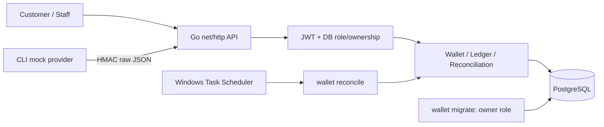
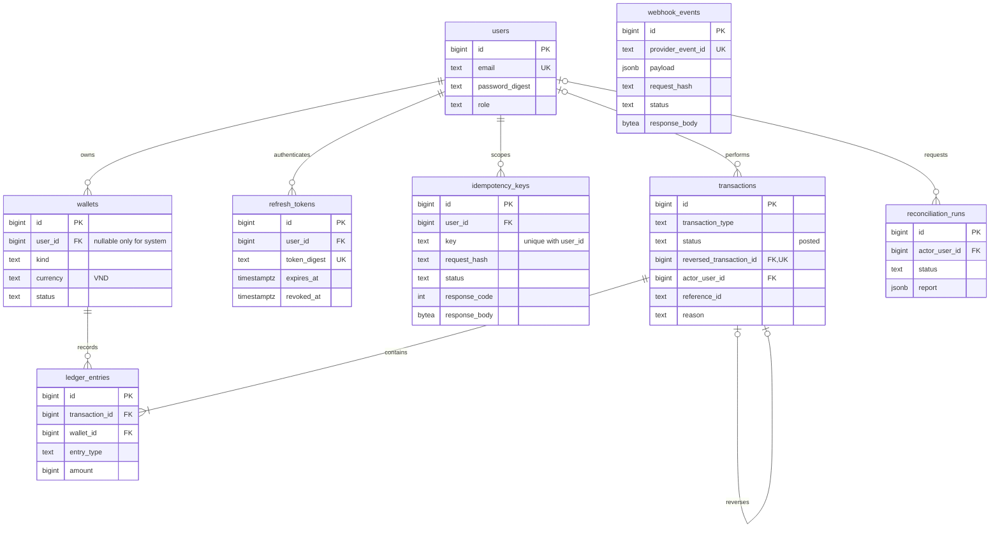
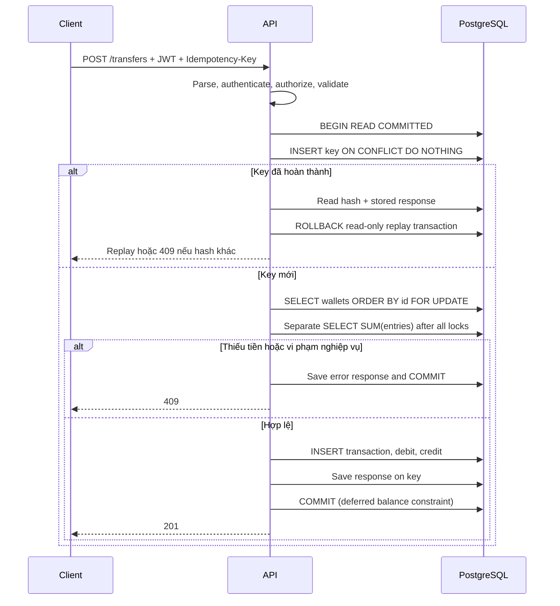

# Kiến trúc và quy ước ledger

Go HTTP monolith → services dùng SQL trực tiếp → PostgreSQL. Migrations chạy bằng role riêng.
Không có repository interface, ORM, Redis hoặc background queue.

## ERD

Webhook event ID được ghi vào `transactions.reference_id` để truy vết; event và giao dịch commit cùng nhau.
Mỗi transaction có đúng hai entries, được deferred constraint trigger kiểm tra tại commit.
Unique `(transaction_id, entry_type)` và `(transaction_id, wallet_id)` bảo đảm hai phía và hai ví khác nhau.

## Debit/credit

Quy ước ví của PoC: **credit tăng, debit giảm**, balance = credits − debits.
Đây là ledger cho số dư ví mô phỏng, chưa phải một chart of accounts đầy đủ cho doanh nghiệp.

- Deposit: debit Provider Clearing, credit ví khách hàng.
- Transfer: debit source, credit destination.
- Reversal: đảo debit/credit của giao dịch gốc, giữ nguyên amount và liên kết bằng `reversed_transaction_id`.
- Chỉ clearing được âm; kiểm tra không âm và overflow nằm trong service chung sau khi khóa ví.

## Transfer và commit

Không tính balance trước lock hoặc trong cùng statement đang chờ lock.
Tất cả luồng ghi tiền khóa ví theo ID tăng dần. Reversal khóa giao dịch gốc trước các ví;
unique `reversed_transaction_id` bổ sung bảo vệ chống hoàn hai lần.
Reconciliation dùng một SQL statement cho tất cả phép kiểm tra để tránh trộn snapshot.

Key/event và ledger cùng commit nên mất response sau commit không tạo lần ghi thứ hai khi retry.
Lỗi DB rollback cả key/event lẫn entries. Lỗi nghiệp vụ được replay, không tự chạy lại sau khi số dư thay đổi.
Không gọi provider/network trong transaction.

## Bảo vệ và giới hạn

Role ứng dụng có SELECT/INSERT cần thiết và UPDATE giới hạn cho token/idempotency/event.
UPDATE riêng cột `id` của wallets/transactions cho phép PostgreSQL thực hiện `SELECT FOR UPDATE`;
API không có đường cập nhật ID. Trigger chặn sửa/xóa ledger và transactions kể cả qua tài khoản owner thông thường.
Superuser có thể bypass trigger; chỉ suite test dùng khả năng này trong database riêng để tạo anomaly.

`post` là đường ghi sổ duy nhất trong ứng dụng. Kiểm tra không âm dựa vào mọi caller tuân thủ luồng khóa này;
không coi truy cập SQL đặc quyền tùy ý là một API ghi tiền được hỗ trợ.
Chưa triển khai cleanup idempotency, balance snapshots hoặc phân vùng ledger.
